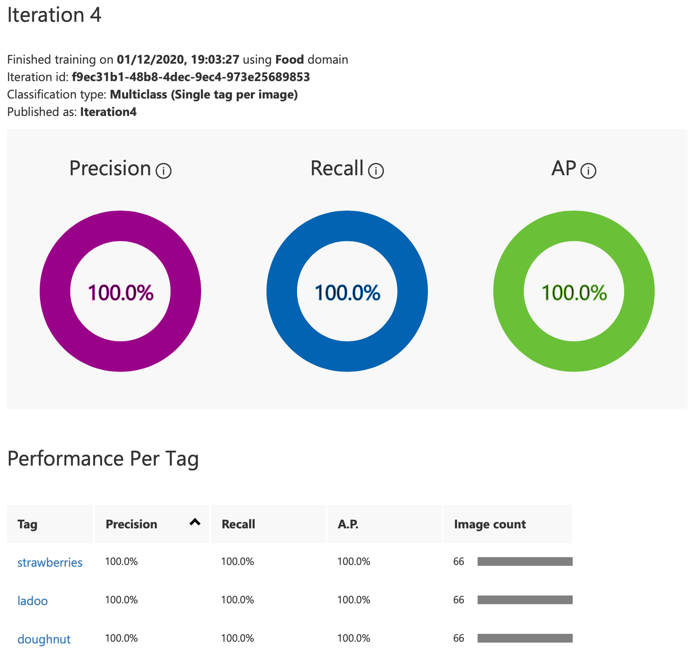

# Challenge 2: Lovely Ladoos

## Solution
Full details on how the Custom Vision resources were created and setup, along with details on the Azure Function are below.

The solution contains a Vue.js frontend to allow users to input the image URL of their ladoo's, and an Azure Function as the backend to make the call to the Custom Vision predictor to analyse the image.

Both the front and backend are then hosted in an Azure Static Web app.

You can try out a working version deployed to an Azure Static Web App [here](https://http://www.lovelyladoos.cloud).


You can also run the Azure Function on it's own. Just start running it in your favourite IDE, or deploy to an Azure Function app. The function works with both a query string or body to pass the image URL. For example:

`http://localhost:7071/api/LadooPredictor?imageUrl=https://www.ambalafoods.com/images/ladoo_s.png`


Or

`http://localhost:7071/api/LadooPredictor` with a body of:

```json
{
    "imageUrl": "https://www.ambalafoods.com/images/ladoo_s.png"
}
```


## Setup

### Custom Vision

#### Create Custom Vision resources

To get started, you will need to create a Custom Vision resource. You can do so with either [this link](https://portal.azure.com/?microsoft_azure_marketplace_ItemHideKey=microsoft_azure_cognitiveservices_customvision#create/Microsoft.CognitiveServicesCustomVision), or you can use the Azure CLI:

```
az group create --name lovely-ladoos --location uksouth
```

```
az cognitiveservices account create --name lovelyladoos-prediction --resource-group lovely-ladoos --kind CustomVision.Prediction --sku F0 --location uksouth --yes
az cognitiveservices account create --name lovelyladoos-training --resource-group lovely-ladoos --kind CustomVision.Training --sku F0 --location uksouth --yes
```

#### Create a new project
In your web browser, navigate to the [Custom Vision web page](https://customvision.ai/) and select Sign in. Sign in with the same account you used to sign into the Azure portal.
1. To create your first project, select **New Project**. The Create new project dialog box will appear.
1. Enter the following information
  * **Name** - 'Lovely Ladoos'
  * **Description** - 'Project to classify images for the lovely ladies challenge as part of #SeasonsOfServerless'
  * **Resource** - If not already selected, your newly created lovelyladoos-training resource.
  * **Project Types** - Classification
  * **Classification Types** - Multiclass
  * **Domains** - Food

#### Upload and tag images
1. Click on `Add Images` and select the images from the `ladoo-dataset` folder.
1. in the **My Tags** field, add `ladoo`.
1. Upload the files.

#### Train the classifier

To train the classifier, select the Train button. The classifier uses all of the current images to create a model that identifies the visual qualities of each tag. This should only take a few minutes.

Once trained, the Custom Vision portal will show the results, and they will look a bit like this:


All looks good with 100%? That is not the case. The model has only been trained with one tag, and so everything will be a ladoo at the moment. The model therefore needs training with additional images that have different tags. So upload some other images of sweets, or anything you like, but make sure to end up with about three tags. Also, make sure the dataset's for each tag contain around the same number of images, otherwise you will build bias into the model.

Here is the training result of iteration two, after adding additional tags:



If you want to spend more time improving the prediction, take a look at [How to improve your classifier](https://docs.microsoft.com/en-gb/azure/cognitive-services/custom-vision-service/getting-started-improving-your-classifier).

#### Publish your trained iteration
Once happy, it is time to publish the trained iteration you are happy with, so that images can be submitted to the prediction API. To do so, just select the iteration you wish to publish in the **Performance** tab, and click **Publish**. This will then make the **Publish URL** link active to get your prediction URL's and keys.

#### Finished project

You should then have something that looks a bit like this on your main homepage:


#### Links

[Build a classifier with the Custom Vision website](https://docs.microsoft.com/en-gb/azure/cognitive-services/custom-vision-service/getting-started-build-a-classifier)

[Create an image classification project with the Custom Vision client library](https://docs.microsoft.com/en-us/azure/cognitive-services/custom-vision-service/quickstarts/image-classification?tabs=visual-studio&pivots=programming-language-csharp)

### Azure Functions

New that the Custom Vision trained iteration has been published, it can be used to predict images. For this an Azure Function can be used. A query string parameter can take the image URL, and then make a call to the Custom Vision project using a `CustomVisionPredictionClient` object.

The Function uses four variables. So the following will need setting up:

```json
"CUSTOM_VISION_ENDPOINT": "<Your prediction resource endpoint, for example https://uksouth.api.cognitive.microsoft.com/>",
"CUSTOM_VISION_PREDICTION_KEY": "<Key from the Published URL link of your projects performance page>",
"CUSTOM_VISION_PROJECT_ID": "<The Id of your project which can be found using the gear icon in the top right of your project>",
"CUSTOM_VISION_PUBLISHED_NAME": "<Name of the published iteration>"
```

Once these are in place, creating a `CustomVisionPredictionClient` is very simple:

```csharp
private static CustomVisionPredictionClient AuthenticatePrediction(string endpoint, string predictionKey)
{
    // Create a prediction endpoint, passing in the obtained prediction key
    CustomVisionPredictionClient predictionApi = new CustomVisionPredictionClient(new Microsoft.Azure.CognitiveServices.Vision.CustomVision.Prediction.ApiKeyServiceClientCredentials(predictionKey))
    {
        Endpoint = endpoint
    };
    return predictionApi;
}
```

Using the `ClassifyImageUrlAsync` will then predict the images
```csharp
var predictionApi = AuthenticatePrediction(endpoint, predictionKey);

var prediction = await predictionApi.ClassifyImageUrlAsync(projectId, publishedName, new ImageUrl(imageUrl), null);
```

All being well, you will get results similiar to:

```json
"[
  {"probability":0.986705,"tagId":"a5189b98-6483-42e2-a9c2-1e668fa8323f","tagName":"ladoo","boundingBox":null,"tagType":"Regular"},
  {"probability":0.00963972,"tagId":"d5135d57-6789-44de-840c-4d69b91bedeb","tagName":"doughnut","boundingBox":null,"tagType":"Regular"},
  {"probability":0.0036553445,"tagId":"b5f3daad-ae57-4f60-9dd3-bf84958b0ab5","tagName":"strawberries","boundingBox":null,"tagType":"Regular"}
]"
```

# The Challenge

## Your Chefs: Jasmine Greenaway, Cloud Advocate (Microsoft) with Soumya Narapaju and Aditya Raman, Microsoft Student Ambassadors

## This week's featured region: India

It's Diwali season in India! Diwali is a festival that celebrates the victory of light over darkness. Families celebrate with fireworks and light up every house in the country with diyas, a type of Indian candles. A very popular delicacy that Indians eat during Diwali is ladoos.

Ladoos are balls of flour dipped in sugar syrup. Since we're in the middle of a global pandemic, most of the celebrations have to be done from home and we have to be innovative to find our inner child to have fun during Diwali 2020. Thanks to technology, however, we're still connected to our loved ones virtually!
## Your challenge 🍽

Create a machine learning model that can analyze images of ladoos made for Diwali. This way, folks can upload an image of their ladoos and see how well the model predicts whether they are a proper ladoo. You'll want to create a serverless function to handle image uploads to test the model. You'll also need a dataset of ladoos, and we've added some in [this folder](/graphics/ladoo-dataset), but make sure to train on other types of sweets like doughnut holes, for comparison. Tip: use a [browser extension](https://chrome.google.com/webstore/detail/download-all-images/nnffbdeachhbpfapjklmpnmjcgamcdmm) to scrape the web for more images. Your ladoo model will serve as a judge to your skill in making ladoos. This is a playful way to channel your inner child for Diwali!

## Resources/Tools Used 🚀

-   **[Visual Studio Code](https://code.visualstudio.com/?WT.mc_id=academic-10922-cxa)**
-   **[Postman](https://www.getpostman.com/downloads/)**
-   **[Azure Functions Extension](https://marketplace.visualstudio.com/items?itemName=ms-azuretools.vscode-azurefunctions&WT.mc_id=academic-10922-cxa)**

## Next Steps 🏃

Learn more about serverless!

  ✅ **[Serverless Free Courses](https://docs.microsoft.com/learn/browse/?term=azure%20functions&WT.mc_id=academic-10922-cxa)**

## Important Resources ⭐️

  ✅ **[Azure Functions documentation](https://docs.microsoft.com/azure/azure-functions/?WT.mc_id=academic-10922-cxa)**

  ✅ **[Azure SDK for JavaScript Documentation](https://docs.microsoft.com/azure/javascript/?WT.mc_id=academic-10922-cxa)**

  ✅ **[Create your first function using Visual Studio Code](https://docs.microsoft.com/azure/azure-functions/functions-create-first-function-vs-code?WT.mc_id=academic-10922-cxa)**

  ✅ **[Free E-Book - Azure Serverless Computing Cookbook, Second Edition](https://azure.microsoft.com/resources/azure-serverless-computing-cookbook/?WT.mc_id=academic-10922-cxa)**

## Ready to submit a solution to this challenge? Here's how 🚀

Open an [issue](https://github.com/microsoft/Seasons-of-Serverless/issues/new?assignees=&labels=&template=seasons-of-serverless-solution.md&title=Solution) in this repo, with a link to your challenge and a brief explanation of how you solved it. We will take a look, approve it if appropriate, and a tag with the appropriate week. If your solution is picked as a weekly standout solution, we'll send you a little prize!
