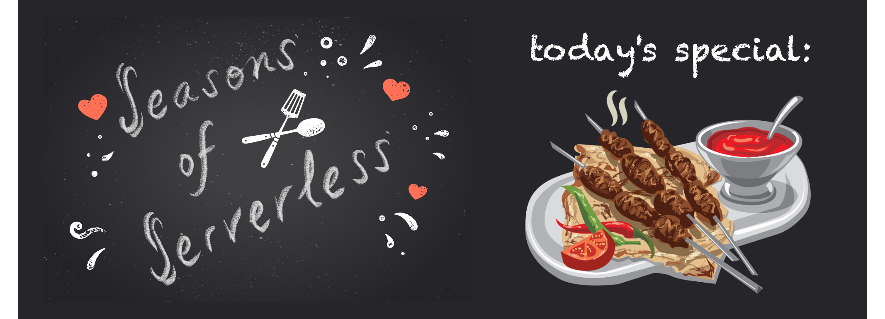
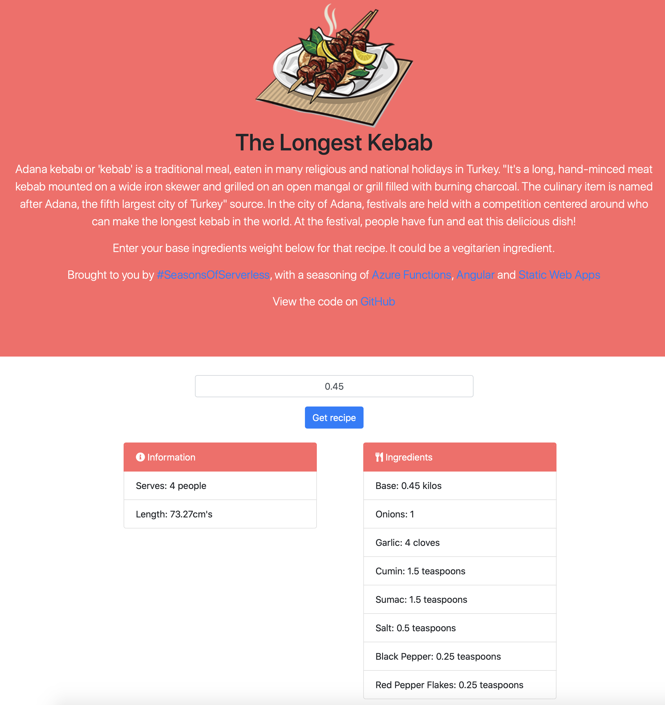
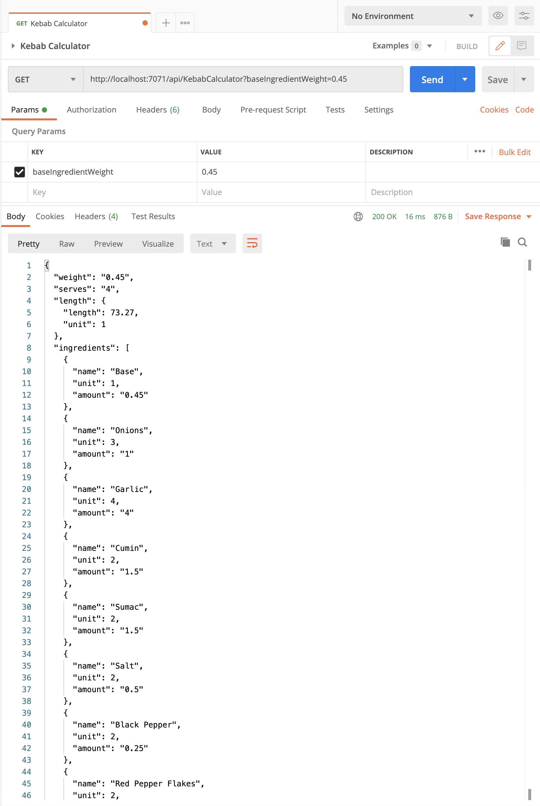
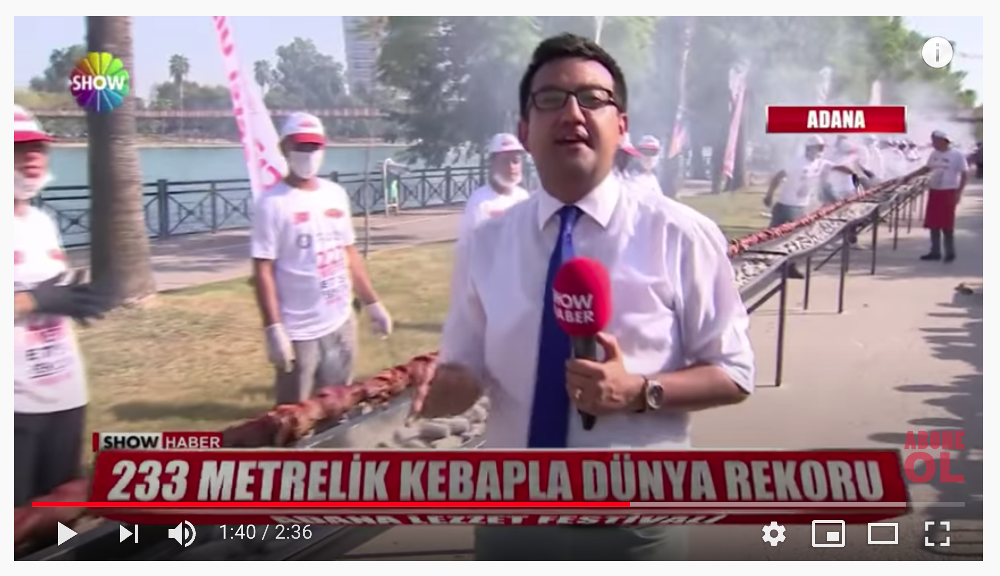

# Challenge 2: The Longest Kebab

## Solution
The solution contains a Angular frontend to allow users to input the weight of their main ingredient, and an Azure Function as the backend to calculate the right amount of ingredients.

The reason behind the term 'main ingredient' and `baseIngredientWeight` in the code, is to try and show that the kebabs do not need to be made from meat. There could be vegetarian options as well.

The length calculation came from reading [Turkish Ground Lamb Kebabs (Adana Kebabs)](https://www.saveur.com/turkish-ground-lamb-kebabs-recipe/). Taking into account the amount of meat in that recipe, the number it servers, and the length of the skewers suggested, it came to about 156g equaled 25.4cm. It may only be an estimation, but these challenges are all about having fun.

Both the front and backend are then hosted in an Azure Static Web app.

## Try it yourself
You can try out a working version deployed to an Azure Static Web App [here](https://www.http://thelongestkebab.cloud).

You can also run the Azure Function on it's own. Just start running it in your favourite IDE, or deploy to an Azure Function app. The function works with both a query string or body to pass the turkey weight. With the `POST` verb of course. For example:

`http://localhost:7071/api/KebabCalculator?baseIngredientWeight=0.45`

# The Challenge

## Your Chefs: Cecil Phillip, Cloud Advocate (Microsoft) with Baris Ceviz, Microsoft Student Ambassador

## This week's featured region: Turkey

`Adana kebabı` or 'kebab' is a traditional meal, eaten in many religious and national holidays in Turkey. "It's a long, hand-minced meat kebab mounted on a wide iron skewer and grilled on an open `mangal` or grill filled with burning charcoal. The culinary item is named after Adana, the fifth largest city of Turkey" [source](https://en.wikipedia.org/wiki/Adana_kebab%C4%B1). In the city of Adana, festivals are held with a competition centered around who can make the longest kebab in the world. At the festival, people have fun and eat this delicious dish!

> A [233 meter kebab](https://www.youtube.com/watch?v=yj4FADNGhMY&ab_channel=ShowAnaHaber)!
## Your challenge 🍽

The most common problem in this festival is calculating how much material is needed to create the longest possible kebab based on the amount of material you have on hand. Since there are so many people at the festival, and you'd like to serve them all, the materials must be calculated quickly.

You need to produce a fast serverless solution to this problem. Create a **kebab calculator** that, given a certain amount of meat in kilos, can calculate how many people you'll be able to feed as well as how long your kebab can be!

Keep in mind that kebabs aren't only made of meat! Here's a [recipe](https://www.thespruceeats.com/adana-kebab-4164647) that you can work with:

- 2 kilos ground lamb
- 1 small onion (minced)
- 4 cloves garlic (minced)
- 1 1/2 teaspoons ground cumin (divided)
- 1 1/2 teaspoons ground sumac (divided)
- 1/2 teaspoon salt
- 1/4 teaspoon ground black pepper
- 1/4 teaspoon red pepper flakes

With your fast calculator, you might be able to win the prize for the longest kebab!
## Resources/Tools Used 🚀

-   **[Visual Studio Code](https://code.visualstudio.com/?WT.mc_id=academic-10922-cxa)**
-   **[Postman](https://www.getpostman.com/downloads/)**
-   **[Azure Functions Extension](https://marketplace.visualstudio.com/items?itemName=ms-azuretools.vscode-azurefunctions&WT.mc_id=academic-10922-cxa)**

## Next Steps 🏃

Learn more about serverless!

  ✅ **[Serverless Free Courses](https://docs.microsoft.com/learn/browse/?term=azure%20functions&WT.mc_id=academic-10922-cxa)**

## Important Resources ⭐️

  ✅ **[Azure Functions documentation](https://docs.microsoft.com/azure/azure-functions/?WT.mc_id=academic-10922-cxa)**

  ✅ **[Azure SDK for JavaScript Documentation](https://docs.microsoft.com/azure/javascript/?WT.mc_id=academic-10922-cxa)**

  ✅ **[Create your first function using Visual Studio Code](https://docs.microsoft.com/azure/azure-functions/functions-create-first-function-vs-code?WT.mc_id=academic-10922-cxa)**

  ✅ **[Free E-Book - Azure Serverless Computing Cookbook, Second Edition](https://azure.microsoft.com/resources/azure-serverless-computing-cookbook/?WT.mc_id=academic-10922-cxa)**

## Ready to submit a solution to this challenge? Here's how 🚀

Open an [issue](https://github.com/microsoft/Seasons-of-Serverless/issues/new?assignees=&labels=&template=seasons-of-serverless-solution.md&title=Solution) in this repo, with a link to your challenge and a brief explanation of how you solved it. We will take a look, approve it if appropriate, and a tag with the appropriate week. If your solution is picked as a weekly standout solution, we'll send you a little prize!
