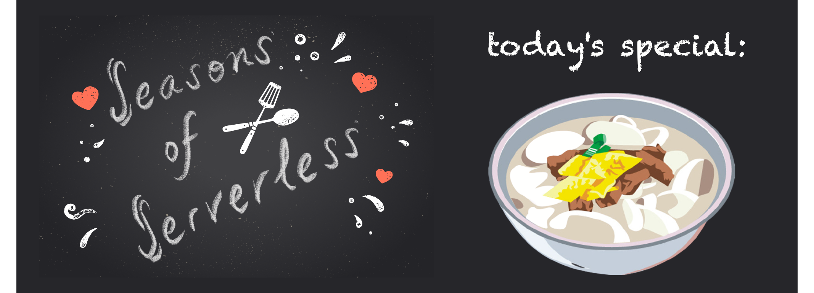
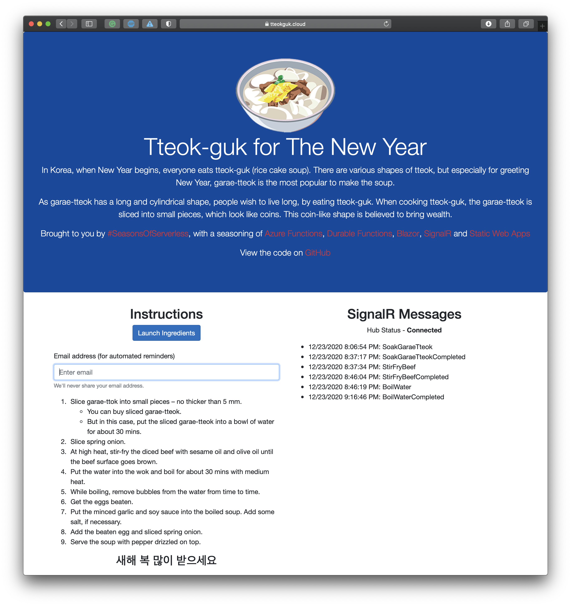

# Challenge 5: Tteok-guk for The New Year

## Solution

This solution names use of a Blazor WASM UI, Azure Functions, SignalR and SendGrid. For the Functions, Durable Entities are used to keep track of the 'waiting' periods, and then SignalR is used to broadcast 'completed' messages back to the UI. SendGrid is also used to send reminder emails.

### Try it yourself
You can try out a working version deployed to an Azure Static Web App [here](https://www.tteokguk.cloud).

Here are some screenshots of the completed process.




### Resource Setup
As of developing this, Static Web apps only support Http Triggers. Therefore, the Functions need to be hosted in a Function App. To create this, along with the other resources needed, you can use the following AZ CLI commands, replacing values which are relevant for you:

```
az storage account create --name <NAME> --resource-group <RESOURCE-GROUP-NAME> --location <LOCATION> --kind StorageV2 --sku Standard_LRS

az signalr create --name <NAME> --resource-group <RESOURCE-GROUP-NAME> --location <LOCATION> --sku Free_F1 --unit-count 1 --service-mode Serverless --enable-message-logs True

az functionapp create --resource-group <RESOURCE-GROUP-NAME> --consumption-plan-location <LOCATION> --runtime dotnet --functions-version 3 --name <NAME> --os-type Linux --storage-account <STORAGE-ACCOUNT-NAME>
```

You will also need a SendGrid account. The free developer tier should be sufficient. You can create an account [here](https://signup.sendgrid.com) and just follow the instructions to set up email sending. Part of this process will be the generation of a key which you will need below.

Add new application settings to the Function App:
```
Name: AzureSignalRConnectionString
Value: <SIGNAL-R-CONNECTION-STRING>

Name: SENDGRID_API_KEY
Value: <SENDGRID-API-KEY>
```
You can get the SignalR Connection String from the `Key` blade of the SignalR resource.

You will also need to edit the following information in the code. In an ideal world, these would be through config settings (something to change in the future):

* The variable named `functionAppBaseUri` in the Blazor `Index.razor` file. This needs to be the URL from the Function App created above.
* The email addresses in the Functions used as the 'From' address for SendGrid. This should be known from setting up the account and validating the sending address.

Deploy the Functions to the function app and the Blazor WASM UI to a Static Web App.

Don't forget to add the domain names being used by the Static Web App to the `CORS` blade on the Function App and SignalR resources.

# The Challenge

## Your Chefs: Justin Yoo (Cloud Advocate, Microsoft) and You Jin Kim, Hong Min Kim and Aaron Roh (Microsoft Student Ambassadors)
## This week's featured region: Korea

In Korea, when New Year begins, everyone eats tteok-guk (rice cake soup). There are various shapes of tteok, but especially for greeting New Year, garae-tteok is the most popular to make the soup.

As garae-tteok has a long and cylindrical shape, people wish to live long, by eating tteok-guk. When cooking tteok-guk, the garae-tteok is sliced into small pieces, which look like coins. This coin-like shape is believed to bring wealth.


> [Image credit](https://blog.naver.com/cjstar1/220918926273)

### Ingredients (for 4 people)

- Garae-tteok: 400g
- Diced beef: 100g
- Water: 10 cups
- Eggs: 2
- Spring onion: 1
- Minced garlic: 1 tablespoon
- Soy sauce: 2 tablespoon
- Sesame oil: 1 tablespoon
- Olive oil: 1 tablespoon
- Salt and pepper

### Recipe

1. Slice garae-ttok into small pieces – no thicker than 5 mm.
   - You can buy sliced garae-tteok.
   - But in this case, put the sliced garae-tteok into a bowl of water for about 30 mins.
2. Slice spring onion.
3. At high heat, stir-fry the diced beef with sesame oil and olive oil until the beef surface goes brown.
4. Put the water into the wok and boil for about 30 mins with medium heat.
5. While boiling, remove bubbles from the water from time to time.
6. Get the eggs beaten.
7. After the 30 mins, put the minced garlic and soy sauce into the boiled soup. Add some salt, if necessary.
8. Add the beaten egg and sliced spring onion.
9. Serve the soup with pepper drizzled on top.

## Your challenge 🍽

This recipe calls for several steps, and we want to create an automated process to set reminders for each step. For example, if you buy the sliced garae-tteok, you should wait for 30 mins for them to soak. Make sure that the stir-fried beef goes brown in 8 mins but it may take longer than that! And don't let anything burn! This is a good opportunity to try [Azure Functions](https://azure.microsoft.com/services/functions/?WT.mc_id=academic-10922-cxa), [Azure Durable Functions](https://docs.microsoft.com/azure/azure-functions/durable/durable-functions-overview?tabs=csharp&WT.mc_id=academic-10922-cxa), [Azure Queue Storage](https://azure.microsoft.com/services/storage/queues/?WT.mc_id=academic-10922-cxa), [Azure Service Bus](https://azure.microsoft.com/services/service-bus/?WT.mc_id=academic-10922-cxa), [Azure Event Grid](https://azure.microsoft.com/services/event-grid/?WT.mc_id=academic-10922-cxa), [Power Platform](https://powerplatform.microsoft.com/?WT.mc_id=academic-10922-cxa) or something else!

## Resources/Tools Used 🚀

- **[Visual Studio Code](https://code.visualstudio.com/?WT.mc_id=academic-10922-cxa)**
- **[Postman](https://www.getpostman.com/downloads/)**
- **[Azure Functions Extension](https://marketplace.visualstudio.com/items?itemName=ms-azuretools.vscode-azurefunctions&WT.mc_id=academic-10922-cxa)**

## Next Steps 🏃

Learn more about serverless!

  ✅ **[Serverless Free Courses](https://docs.microsoft.com/learn/browse/?term=azure%20functions&WT.mc_id=academic-10922-cxa)**

## Important Resources ⭐️

  ✅ **[Azure Functions documentation](https://docs.microsoft.com/azure/azure-functions/?WT.mc_id=academic-10922-cxa)**

  ✅ **[Azure SDK for JavaScript Documentation](https://docs.microsoft.com/azure/javascript/?WT.mc_id=academic-10922-cxa)**

  ✅ **[Azure SDK for Java Documentation](https://docs.microsoft.com/azure/developer/java/?WT.mc_id=academic-10922-cxa)**

  ✅ **[Azure SDK for .NET Documentation](https://docs.microsoft.com/dotnet/azure/?WT.mc_id=academic-10922-cxa)**

  ✅ **[Azure SDK for Python Documentation](https://docs.microsoft.com/azure/developer/python/?WT.mc_id=academic-10922-cxa)**

  ✅ **[Create your first function using Visual Studio Code](https://docs.microsoft.com/azure/azure-functions/functions-create-first-function-vs-code?WT.mc_id=academic-10922-cxa)**

  ✅ **[Power Platform Documentation](https://docs.microsoft.com/power-platform/?WT.mc_id=academic-10922-cxa)**

  ✅ **[Free E-Book - Azure Serverless Computing Cookbook, Second Edition](https://azure.microsoft.com/resources/azure-serverless-computing-cookbook/?WT.mc_id=academic-10922-cxa)**

## Ready to submit a solution to this challenge? Here's how 🚀

Open an [issue](https://github.com/microsoft/Seasons-of-Serverless/issues/new?assignees=&labels=&template=seasons-of-serverless-solution.md&title=Solution) in this repo, with a link to your challenge and a brief explanation of how you solved it. We will take a look, approve it if appropriate, and a tag with the appropriate week. If your solution is picked as a weekly standout solution, we'll send you a little prize!
