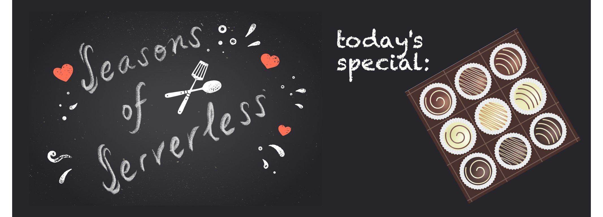
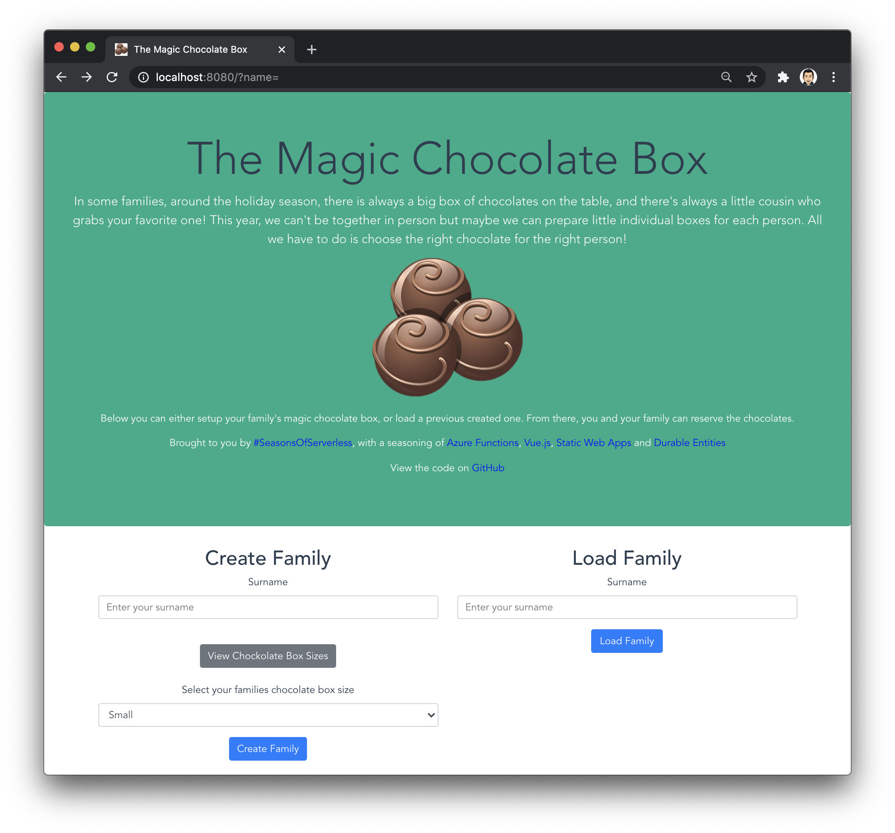
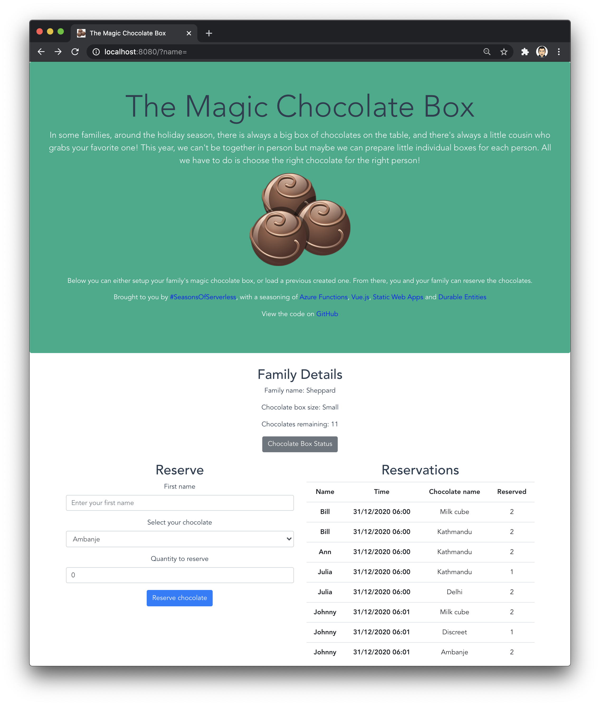

# Challenge 6: The Magic Chocolate Box

## Solution

The solution makes use of Azure Functions, Vue.js. For the Functions, Durable Entities are used to maintain the state of different families. This state being the chocolate box they selected and the reservations their family members have made.

When reading back Durable Entities, only the committed state is returned. This means that there may be some events still queued and waiting to be run. As a result of this, the data returned may look like it's not complete. However, it will catch up and be there for the next time you query it.

Although there is a UI to makes things a bit easier, details of the Functions are below. To see an example family reserving their chocolates, you can view the Joneses story [here](SHEPPARDEXAMPLE.md).

### Try it yourself
You can try out a working version deployed to an Azure Static Web App [here](https://www.magicchocolatebox.cloud).

Here are some screenshots of the completed process.




### Resource Setup
As Durable Entities are being used, a Storage Account is needed. Also, ss of developing this, Static Web Apps only support Http Triggers. Therefore, the Functions need to be hosted in a Function App. To create this, along with the other resources needed, you can use the following AZ CLI commands, replacing values which are relevant for you:

```
az storage account create --name <NAME> --resource-group <RESOURCE-GROUP-NAME> --location <LOCATION> --kind StorageV2 --sku Standard_LRS

az functionapp create --resource-group seasons-of-serverless --consumption-plan-location uksouth --runtime dotnet --functions-version 3 --name magicchocolatebox --os-type Linux --storage-account magicchocolatebox
```

Deploy the Functions to the function app and the Vue.js UI to a Static Web App.

Don't forget to add the domain names being used by the Static Web App to the `CORS` blade on the Function App resource.

### HTTP Calls

#### Create Family
* Description: Creates the Durable Entity for the family, with the given chocolate box size. This is so that multiple families can use the solution.
* Endpoint: `api/createfamily`
* Verb: `POST`
* Body:
```json
{
    "familyName": string,
    "chocolateBoxSize": int (1 = Small, 2 = Medium, 3 = Large)
}
```

#### Reserve
* Description: Where a family member can reserve their chocolates. Error handling is built in so that family members can't reserve more than they should.
* Endpoint: `api/reserve`
* Verb: `POST`
* Body:
```json
{
    "familyName": string,
    "name": string,
    "chocolateName": string,
    "quantity": int
}
```

#### Get Family
* Description: View the details for the family. Includes the reservations and remaining chocolates.
* Endpoint: `api/getfamily`
* Verb: `POST`
* Body:
```json
{
    "familyName": string
}
```

#### List Chocolate Boxes
* Description: Lists the details of the three chocolate boxes.
* Endpoint: `api/listchocolateboxes`
* Verb: `GET`

#### List Chocolates
* Description: Lists the chocolates available in the selected size box.
* Endpoint: `api/listchocolates/{int (1 = Small, 2 = Medium, 3 = Large)}`
* Verb: `GET`

# The Challenge

## Your Chefs: Christopher Maneu, Cloud Advocate, with Abdelmoumene Boumadane and Christopher Chichmanian, Microsoft Student Ambassadors

## This week's featured region: France

Dans certaines familles, autour de Noël, il y a toujours une grosse boîte de chocolats....et il y a toujours un cousin pour vous piquer vos chocolats préférés. Cette année, Nous ne pouvons probablement pas être tous réunis autour d'une même grande boîte, mais nous pouvons préparer des petites boîtes individuelles...il ne reste plus qu'à choisir ses chocolats!

Développons une solution serverless pour permettre à chaque membre de la famille de choisir les chocolats qu'il désire...mais parmi un choix limité!

---

In some families, around the holiday season, there is always a big box of chocolates on the table, and there's always a little cousin who grabs your favorite one! This year, we can't be together in person but maybe we can prepare little individual boxes for each person. All we have to do is choose the right chocolate for the right person!

## Your challenge 🍽

Develop a serverless solution that will allow each family member to let you know their favorite chocolates from your family's limited choice. You might want to reserve your own favorite ones in advance! And you'll need to get creative to divide the chocolates evenly, or according to the individual person's taste (or merit?). Here's a [list of chocolate varieties](https://www.vogue.fr/lifestyle-en/article/the-10-best-parisian-chocolatiers-of-2019) to inspire you.

## Special Santa Secret!

Ho Ho Ho, try [Durable Entities](https://docs.microsoft.com/en-us/azure/azure-functions/durable/durable-functions-entities?tabs=csharp&WT.mc_id=academic-10922-cxa) for this challenge!

## Resources/Tools Used 🚀

-   **[Visual Studio Code](https://code.visualstudio.com/?WT.mc_id=academic-10922-cxa)**
-   **[Postman](https://www.getpostman.com/downloads/)**
-   **[Azure Functions Extension](https://marketplace.visualstudio.com/items?itemName=ms-azuretools.vscode-azurefunctions&WT.mc_id=academic-10922-cxa)**

## Next Steps 🏃

Learn more about serverless!

  ✅ **[Serverless Free Courses](https://docs.microsoft.com/learn/browse/?term=azure%20functions&WT.mc_id=academic-10922-cxa)**

## Important Resources ⭐️

  ✅ **[Azure Functions documentation](https://docs.microsoft.com/azure/azure-functions/?WT.mc_id=academic-10922-cxa)**

  ✅ **[Azure SDK for JavaScript Documentation](https://docs.microsoft.com/azure/javascript/?WT.mc_id=academic-10922-cxa)**

  ✅ **[Create your first function using Visual Studio Code](https://docs.microsoft.com/azure/azure-functions/functions-create-first-function-vs-code?WT.mc_id=academic-10922-cxa)**

  ✅ **[Free E-Book - Azure Serverless Computing Cookbook, Second Edition](https://azure.microsoft.com/resources/azure-serverless-computing-cookbook/?WT.mc_id=academic-10922-cxa)**

## Ready to submit a solution to this challenge? Here's how 🚀

Open an [issue](https://github.com/microsoft/Seasons-of-Serverless/issues/new?assignees=&labels=&template=seasons-of-serverless-solution.md&title=Solution) in this repo, with a link to your challenge and a brief explanation of how you solved it. We will take a look, approve it if appropriate, and a tag with the appropriate week. If your solution is picked as a weekly standout solution, we'll send you a little prize!
