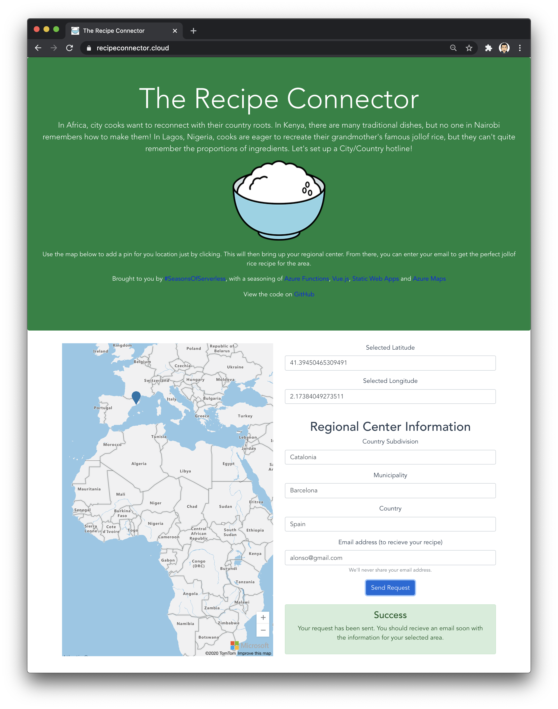
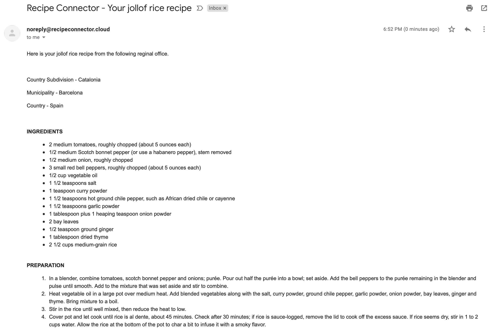

# Challenge 7: The Recipe Connector

## Solution
The solution may seem a bit more complicated that the challenge may suggest. I had already started the code and used Azure Maps to use geoJSON when the challenge changed. However, I thought I would stick with it, and put my twist on it, which hopefully still fits in. SendGrid has also been used instead of Twilio, but emailing your grandparents is almost as good.

The solution and path that a user would use is:

* Navigate to [The Recipe Connector](https://www.recipeconnector.cloud).
* From there, navigate around the map (Azure Maps) to find where you would like your jollof recipe to come from.
* Drop a pin, just by clicking on the map, and some information on the right should pop up. This is the lat/long selected as well as the 'regional centre'. This is populated by making a call to the Azure Maps API to get information on the location where you dropped the pin.
* Fill in your email address for Grandma to contact you on and click 'Send Request'. This will send the request via a queue (Storage Account) before being picked up by an Azure Function.
* You should then receive an email back with your recipe. The recipe is held within a Gist, and while it will be the same every time, it shows the idea that it would vary per region.

### API Calls

Here are the details of the API calls:

Description: Get the details from the dropped pin.
* URL: `https://www.recipeconnector.cloud/api/getregionalcenter/<latitude>/<longitude>`
* Verb: `GET`
* Example request: https://www.recipeconnector.cloud/api/getregionalcenter/-22.503671182039653/17.112660769743826
* Example response:
```json
{
    "countrySubdivision": "Khomas",
    "municipality": "Windhoek East",
    "country": "Namibia"
}
```

Description: Send recipe request to grandma.
* URL: `https://recipenotifier.azurewebsites.net/api/sendrequest`
* Verb: `GET`
* Example body:
```json
{
    "countrySubdivision": "Khomas",
    "municipality": "Windhoek East",
    "country": "Namibia",
    "email": "alonso@gmail.com"
}
```
* Result: This will place a message on a queue and then result in the email.

### Try it yourself
You can try out a working version deployed to an Azure Static Web App [here](https://www.recipeconnector.cloud).

Here are some screenshots of the completed process.




### Resource Setup
As a Function is making use of a Queue binding, a Storage Account is used to hold the queue. Also, as of developing this, Static Web Apps only support Http Triggers. Therefore, some of the Functions need to be hosted in a Function App. To create this, along with the other resources needed, you can use the following AZ CLI commands, replacing values which are relevant for you:
```
az maps account create --name <NAME> --resource-group <RESOURCE-GROUP-NAME> --sku S0

az storage account create --name <NAME> --resource-group <RESOURCE-GROUP-NAME> --location <LOCATION> --kind StorageV2 --sku Standard_LRS

az functionapp create --resource-group <RESOURCE-GROUP-NAME> --consumption-plan-location uksouth --runtime dotnet --functions-version 3 --name <NAME> --os-type Linux --storage-account <STORAGE-ACCOUNT-NAME>
```

# The Challenge

**Your Chefs: Bethany Jepchumba, Adefemi Afuwape and Felix Omuok, Microsoft Student Ambassadors**
## This week's featured region: Africa

In Africa, city cooks want to reconnect with their country roots. In Kenya, there are many traditional dishes, but no one in Nairobi remembers how to make them! In Lagos, Nigeria, cooks are eager to recreate their grandmother's famous jollof rice, but they can't quite remember the proportions of ingredients. Let's set up a City/Country hotline!

## Your challenge 🍽

Create a service that will allow a user to send a query for a specific dish to a given relative of your choosing and receive the appropriate and authentic recipe. You could set up a service to call your Grandma to make sure you have the right ingredients for great jollof rice using [Azure Functions bindings for Twilio](https://docs.microsoft.com/en-us/azure/azure-functions/functions-bindings-twilio?tabs=csharp&WT.mc_id=academic-10922-cxa).


## Resources/Tools Used 🚀

-   **[Visual Studio Code](https://code.visualstudio.com/?WT.mc_id=academic-10922-cxa)**
-   **[Postman](https://www.getpostman.com/downloads/)**
-   **[Azure Functions Extension](https://marketplace.visualstudio.com/items?itemName=ms-azuretools.vscode-azurefunctions&WT.mc_id=academic-10922-cxa)**

## Next Steps 🏃

Learn more about serverless!

  ✅ **[Serverless Free Courses](https://docs.microsoft.com/learn/browse/?term=azure%20functions&WT.mc_id=academic-10922-cxa)**

## Important Resources ⭐️

  ✅ **[Azure Functions documentation](https://docs.microsoft.com/azure/azure-functions/?WT.mc_id=academic-10922-cxa)**

  ✅ **[Azure SDK for JavaScript Documentation](https://docs.microsoft.com/azure/javascript/?WT.mc_id=academic-10922-cxa)**

  ✅ **[Create your first function using Visual Studio Code](https://docs.microsoft.com/azure/azure-functions/functions-create-first-function-vs-code?WT.mc_id=academic-10922-cxa)**

  ✅ **[Free E-Book - Azure Serverless Computing Cookbook, Second Edition](https://azure.microsoft.com/resources/azure-serverless-computing-cookbook/?WT.mc_id=academic-10922-cxa)**

## Ready to submit a solution to this challenge? Here's how 🚀

Open an [issue](https://github.com/microsoft/Seasons-of-Serverless/issues/new?assignees=&labels=&template=seasons-of-serverless-solution.md&title=Solution) in this repo, with a link to your challenge and a brief explanation of how you solved it. We will take a look, approve it if appropriate, and a tag with the appropriate week. If your solution is picked as a weekly standout solution, we'll send you a little prize!
